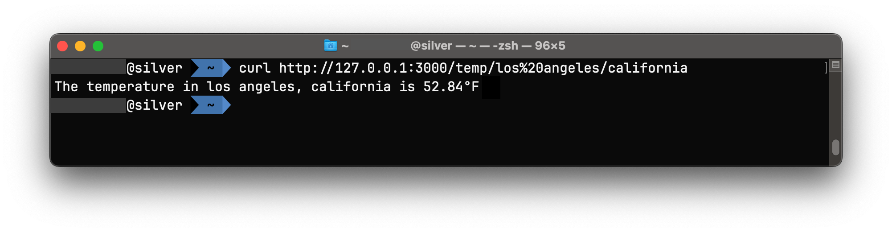

# ☀️🌤 Weather API on express.js

Welcome to a great express.js app, by reading `weather.js` will give you a better idea of how it works.

This instruction is for both `npm` OR `yarn` users; it is your own choice to use what you're most comfortable with. 
But you can't use both at once! If you want to switch, just delete your `*.lock` in root folder and it will be regenereated on installation.

# Important!
Before installing & running this project. You need to replace your API key to API_KEY_HERE in weather.js, which is free up to 1000 requests a day.

#  1. Sign up for API 📦
1. The very first thing you need to do is sign up (free) for Weather API at https://openweathermap.org/api because **it will take few hours to start working**.
2. I chose "Pay as you call"; it's for free on first 1000 API requests a day.

**Note:** It will take few hours for it to start working; two and half hours in my case. Just be patient. If the API is still not ready, the app will return an error fetching information when API is not ready or not properly not applied to the file according to the step 2.2

# 2. Clone my repo and apply your own API 🗂️
1. **Clone this repository** and put it in a folder you won't forget.
   ```bash
   git clone https://github.com/dmxt/weather-express-api.git
   
### 2.1 Obtain an API for weather information
1. **Copy an API they provided you from** https://openweathermap.org/api and replace it with `API_KEY_HERE` on line 11 in `weather.js` 
   
2. Replace API_KEY_HERE with the API provided to you in step 2.
   ```javascript
   const apiKey = 'API_KEY_HERE';
   ```

# 3. Install required packages 📦
Install dependency packages with either npm or yarn but not both by running either:

If you don't know what to pick, go ahead with npm included by Node.js; yarn is
for more sophisticated developers (shortly said)

`npm install`

or

`yarn`

The lockfile will appear in a root directory after installation.

### 3.1 🔐 Notes about lockfiles: 
Two lockfiles (`*.lock`) in same project, **npm** and **yarn**, don't go well together.

If you find a two lockfiles in your directory, which are `yarn.lock` or `package-json.lock`. Delete the one you don't use (or delete both). 
It will generate a new lockfile after running an installation command with no impact. 

You're not supposed to modify `*.lock` files, but you can delete it and reinstall it using your preferred package handler.

`/node_modules/` folder in root will indicate that the server is ready to start.

#  4. ⚡ Start a server! ⚡

Again, make sure you have `/node_modules/` folder in your root directory before starting the app,
otherwise it will not work. If you don't have this folder, use an installation command (or repeat step 3, if it doesn't work, open an issue)

```bash
npm start
```
or
```bash
yarn
```

**npm** or **yarn** is your own personal preference, there is no difference in a scope of this project.

These scripts will run the script `node weather.js` (I set up in package.json)

The console output will provide some example and tips after you start a node server. You can open the link in a browser
or use `curl` in command line to get a temperature information.

## 4.1 How to use curl
It's a good method to use without a browser, just enter a commandline to get your result.

Make sure you have the following:
1. Server is running
2. API is working
3. `curl` commandline program is installed on your system and functional.
```bash
curl http://127.0.0.1:3000/temp/los%20angeles/california
```


---

# Troubleshooting:

### 1. My city or state have a space and it doesn't work!
Make sure you do not use regular spacebar in an URL, otherwise it will return with an error.

`%20` replaces spacebar in URL, otherwise it won't work.
If your city/state have one or more spaces, replace the space with `%20`.

**For an example:**

   ```bash
   http://127.0.0.1:3000/temp/los%20angeles/california
   http://127.0.0.1:3000/temp/new%20york%20city/new%20york
   // %20 = ' ' (spacebar)
   ```

### 2. If you see 'Error getting temperature data!' error 
That means your API key is not working or you just need to wait a little bit longer.

### 3. How to stop a server

Go to the command line where you started a server and press Ctrl+C or close an IDE.

### 3. If it returned nothing
Make sure the server (`node weather.js`) is still running.

---

## Tips 💡
1. If your city or state have one or more spaces, replace the space with `%20`.

   **For an example:**

   ```bash
   http://127.0.0.1:3000/temp/los%20angeles/california
   http://127.0.0.1:3000/temp/new%20york%20city/new%20york
   // %20 = ' ' (spacebar)
   ```

2. **curl**. You can `curl` URL to any cities, and it's not case-sensitive.
It's easier to run a curl command on MacOS, Linux or FreeBSD or any OS with a bash console. On Windows, you'll might need to rely on a browser to get a result.

   **For an example on a console:**
   ```bash
   curl http://127.0.0.1:3000/temp/los%20angeles/california
   ```
   

---

## Questions? Open an Issue

If you have any question, make a new issue on GitHub repository, and I will to get back to you as soon as possible.

---
## ✨ Credits

```text
1. OpenGPT helped tremendously for me to get started by asking how to start a weather app, and it gave me useful
information regarding how to build an app (nothingdirect, but a good start) and included a link to an API. 
2. https://openweathermap.com/api is awesome for providing free API (up to 1000 requests) for us to build on.
```
